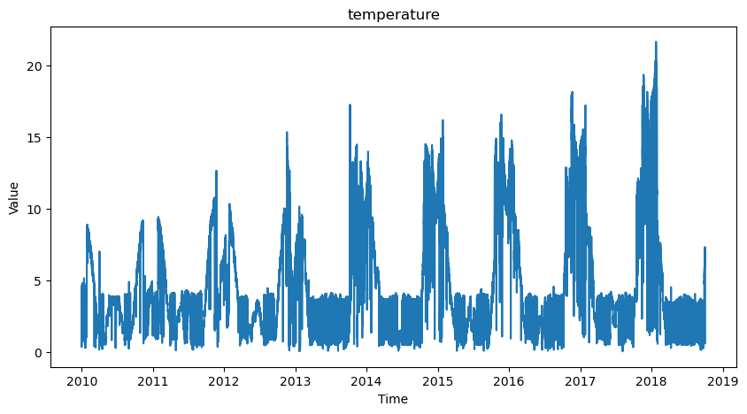
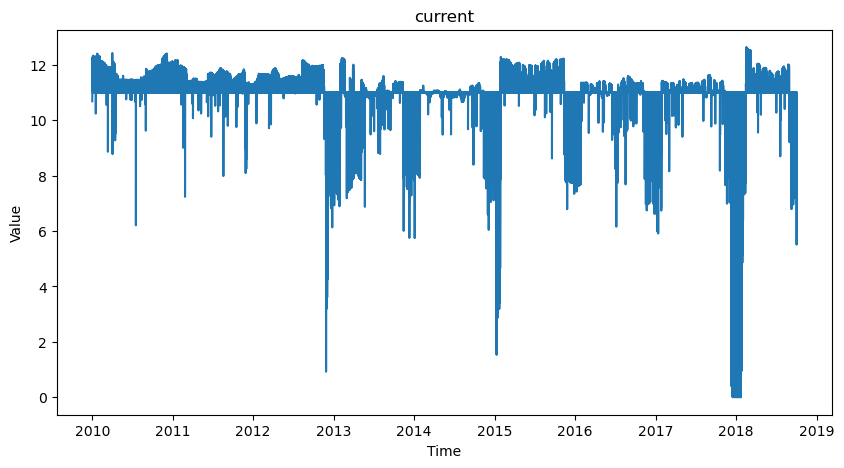
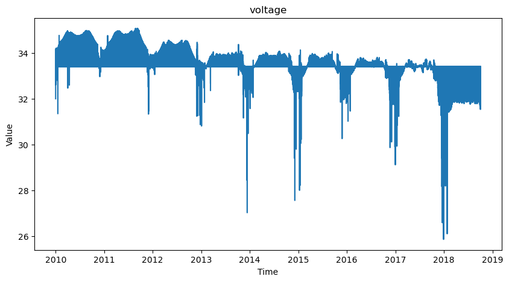
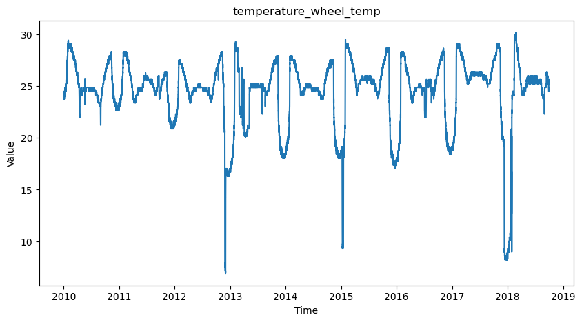
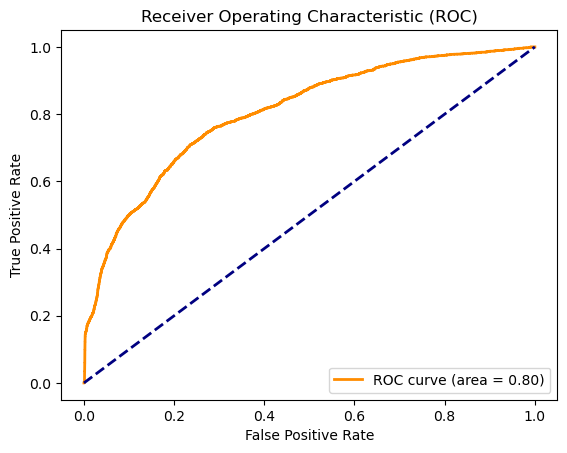
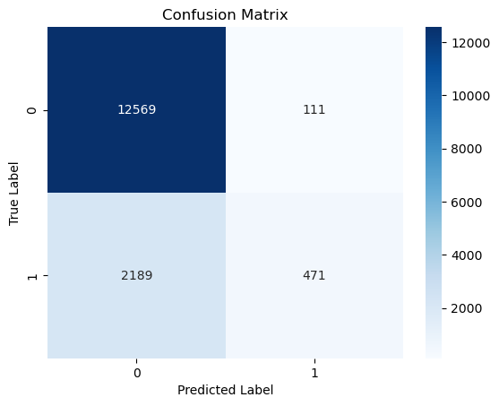
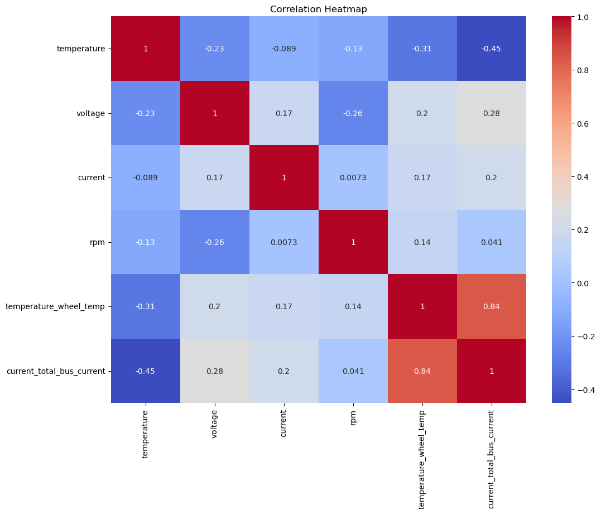

# Satellite Telemetry Analyzer

The Satellite Telemetry Analyzer is a Python application designed to process, visualize, analyze, and model satellite telemetry data. It provides a comprehensive set of functionalities, including data preprocessing, visualization, outlier detection, correlation analysis, modeling, and more.

## Table of Contents

1. [Requirements](#requirements)
2. [Usage](#usage)
3. [Functionality](#functionality)
   - [Data Loading](#data-loading)
   - [Data Preprocessing](#data-preprocessing)
   - [Data Visualization](#data-visualization)
   - [Missing Value Analysis](#missing-value-analysis)
   - [Outlier Analysis](#outlier-analysis)
   - [Correlation Analysis](#correlation-analysis)
   - [Model Fitting](#model-fitting)
   - [Result Export](#result-export)
   - [Variance Inflation Factor Analysis](#variance-inflation-factor-analysis)
   - [Spinning Classification](#spinning-classification)
   - [ROC Curve Plotting](#roc-curve-plotting)
   - [Scaled Data Visualization](#scaled-data-visualization)
4. [Background](#background)
   - [Important definitions](#important-definitions)
      - [Telemetry](#telemetry)
      - [Bus](#bus)
      - [Reaction Wheel](#reaction-wheel)
   - [Implications](#implications)
   - [The Data](#the-data)
5. [Hypothesis](#hypothesis)
   - [Null Hypothesis](#null-hypothesis)
   - [Alternate Hypothesis](#alternate-hypothesis)
6. [Data Cleaning](#data-cleaning)
7. [Visualizations](#visualizations)
8. [Conclusion](#conclusion)
   - [What this means for telemetry analysis](#what-this-means-for-telemetry-analysis)


## Requirements

The following Python libraries are required to run the code:

- pandas
- seaborn
- matplotlib
- numpy
- scikit-learn
- scipy
- statsmodels
- plotly
- argparse

You can install them using the following command:

```bash
pip install pandas seaborn matplotlib numpy scikit-learn scipy statsmodels plotly argparse
```

## Usage

To run the code, you can utilize the command line arguments to specify which functions you want to execute. Here's an example of running the complete analysis:

```bash
python SatelliteTelemetryAnalyzer.py --run_all
```

You can also select specific functionalities:

```bash
python SatelliteTelemetryAnalyzer.py --load_data --preprocess_data --visualize_data
```

## Functionality

### Data Loading

The `load_data` function loads telemetry data from specific CSV files, including battery temperature, bus voltage, total bus current, wheel RPM, and wheel temperature.

### Data Preprocessing

The `preprocess_data` function converts timestamps to the datetime format and merges dataframes based on the timestamp.

### Data Visualization

The `visualize_data` function provides pairplot, boxplot, and time series plot to display different aspects of the data.

### Missing Value Analysis

The `analyze_missing_values` function analyzes and handles missing values by filling them with the mean value of the corresponding column.

### Outlier Analysis

The `analyze_outliers` function identifies and removes outliers using Z-scores.

### Correlation Analysis

The `analyze_correlation` function visualizes the correlation matrix using a heatmap.

### Model Fitting

The `fit_model` function fits a Ridge regression model to the data and calculates the mean squared error of the predictions.

### Result Export

The `export_results` function exports the merged data to a CSV file.

### Variance Inflation Factor Analysis

The `analyze_vif` function computes the Variance Inflation Factor (VIF) for each feature.

### Spinning Classification

The `classify_spinning` function transforms RPM into a binary outcome and trains a logistic regression model to classify whether the satellite is spinning or not. It also evaluates the accuracy.

### ROC Curve Plotting

The `plot_roc_curve` function calculates and plots the Receiver Operating Characteristic (ROC) curve.

### Scaled Data Visualization

The `visualize_scaled_data` function scales numeric columns and plots a time series, along with shading regions where RPM is nonzero.

Please refer to the comments in the code for more specific details on the functioning and usage of each method.

## Background

### Important Defiinitions 
   1. Telemetry
      - Telemetry refers to the automated collection of data from remote locations, such as satellites, and its transmission to receiving equipment for monitoring. In the context of satellites, telemetry data includes information on the satellite's location, temperature, altitude, battery status, and other critical parameters.
   2. Satellite Bus
      - A satellite bus, also referred to as a spacecraft bus, is a general model or platform that functions as the support infrastructure for a satellite. It provides the necessary subsystems and structure to support and interface with the payload, which is the mission-specific part of the satellite.
   3. Reaction Wheel
      - A reaction wheel is a type of device used in satellites to control their orientation without using thrusters or any consumable resources. It's a part of the satellite's attitude control system.
         - The reaction wheel is essentially a flywheel, which is a heavy wheel that spins around a central axis. By adjusting the speed at which the wheel spins, you can change the angular momentum of the entire satellite.
   ### Implications
   
   By creating models that can accurately predict missing data from telemetry signals we can gain insight into what the satellite was doing when it was not on cover by a groundstation. Satellite Telemetry signals are designed to not be as accurate and favors sending mass amounts of data rather than precise data so models like the one seen here can also help filter out bad data in the telemetry signal.

   Additionally, satellite telemetry in recent years is more and more likely to be encrypted. By utilizing models like these we can make better infromed inferences on what a satellite is doing based off of what measurements we can take of the satellite. 
      
   - During the launch telemetry is usually sent in the clear where we can take measurements and charactarize the signals and build predictive models. Later when the signals become encrypted we can then cross-reference the predicitve models and other measurements of the satellie with the encrypted signal to aid in breaking out the telemetry.
### The Data
   The dataset that I used was gathered over ten years by the University of Colorado Boulders Laboratory for Atmospheric and Space Physics (LASP). 
   The data came from an unnamed satellite with a telemetry beacon emitting data at regular intervals. This dataset focused specifically on 5 measurements. `Battery Temperature`, `Bus Current`, `Bus Voltage`, `Reaction Wheel Rotations Per Minute`, and `Reaction Wheel Temperature`.

   For the purposes of this project I completed a supervised machine learning model with Reaction Wheel RPM as the target and the other data points as features to measure if the features worked as indicators that the Reaction Wheel was spinning.

## Hypothesis
### Null Hypothesis
   - Battery Temperature, Bus Voltage, Bus Current, and Reaction Wheel Temperature are not good indicators of the Reaction Wheel spinning.
### Alternate Hypothesis
   - Battery Temperature, Bus Voltage, Bus Current, and Reaction Wheel Temperature are good indicators of the Reaction Wheel Spinning

## Data Cleaning
The data was presented as 5 separate CSV files and their descriptions are as follows:

   - Battery Temperature:
      - cadence: 1 hour
      - time_range: 2008-05-30T00:05:00 through 2018-10-02T18:30:00
      - number_of_samples: 128,288
      - independent_variable: time (YYYY-MM-DD HH:MM:SS)
      - dependent_variable: temperature (C)
   - Bus Voltage:
      - cadence: 3 hours
      - time_range: 2001-01-21T21:00:00 through 2018-10-02T18:00:00
      - number_of_samples: 51,704
      - independent_variable: time (YYYY-MM-DD HH:MM:SS)
      - dependent_variable: voltage
   - Bus Current:
      - cadence: 24 hours
      - time_range: 2004-02-14T00:00:00 through 2018-10-02T00:00:00
      - number_of_samples: 5,345
      - independent_variable: time (YYYY-MM-DD HH:MM:SS)
      - dependent_variable: current (A)
   - Reaction Wheel Temperature:
      - cadence: 10 minutes
      - time_range: 2004-02-13T13:10:00 through 2018-10-02T23:50:00
      - number_of_samples: 769,745
      - independent_variable: time (YYYY-MM-DD HH:MM:SS)
      - dependent_variable: temperature (C)
   - Reaction Wheel RPM(target variable):
      - cadence: 5 minutes
      - time_range: 2009-05-22T22:35:00 through 2018-10-02T18:25:00
      - number_of_samples: 984,911
      - independent_variable: time (YYYY-MM-DD HH:MM:SS)
      - dependent_variable: RPM

Beacuse of the variance in range in which the data was collected I decided to only analyze the data from 2010 and onwards. The cadence in which values were collected did not prove to impact the analysis negatively and were therefore not handled.

The RPM category did contain nan values which was interpreted to mean that the wheel was not spinning and was treated as a zero.

As telemetry data prioritizes connection stability over measurement accuracy there were a few bad values in the data such as negative values or extreme outliers. I cut out any rows with negative values and I removed outliers with a z-score of over 2 and under -2. This cutoff was deemed appropriate after testing multiple thresholds and setting it to 2 provided the best results for removing outliers and not impacting real data points.
   - In this context outliers represented corrupted data rather than data that was real and just outside of the normal threshold 

   ## Visualizations
### Battery Temperature over time
   
### Bus Current over time
   
### Bus Voltage over time
   
### Reaction Wheel Temperature
   
### ROC Curve
   
### Confusion Matrix
   
### Correlation Matrix
   

   ## Conclusion

The Variance Inflation Factor showed that the Reaction Wheel Temperature and Current Bus Total, 3.6 and 4.2 respectively were the greatest indicators of factors in being able to determine whether or not the Reaction Wheel was spinning.

The Logistic Regression model produced an accurate result 85% percent of the time.

### What this means for telemetry analysis

After careful examination and modeling of the satellite telemetry data from the University of Colorado Boulder's Laboratory for Atmospheric and Space Physics (LASP), several valuable insights were gathered. Notably, the correlations between certain telemetry parameters and the operation of the satellite's reaction wheel were uncovered.

1. **Significance of Reaction Wheel RPM**: The reaction wheel's RPM, being the focal point of this study, was successfully used as a target variable for our machine learning model. By predicting its activity, it is possible to determine vital aspects of satellite orientation control.

2. **Features as Indicators**: Battery Temperature, Bus Voltage, Bus Current, and Reaction Wheel Temperature were rigorously tested as predictors. Our initial hypothesis was evaluated against the dataset, and it was found that these telemetry features served as good indicators of whether the Reaction Wheel was in operation. Therefore, I was able to reject the null hypothesis and adopt the alternative.

3. **Dealing with Imperfections**: The data was not without its challenges. Incomplete or missing readings, potential anomalies, and differing cadences across measurements required meticulous data cleaning and preprocessing. However, this process further highlighted the importance of refining raw telemetry data to extract meaningful and actionable insights.

4. **Implications of Visualizations**: The presented visualizations serve as an excellent tool for understanding the behavior of individual telemetry parameters over time. Such graphical representations enable domain experts, engineers, and data scientists to visually detect patterns, anomalies, or any correlations between different parameters.

5. **Value of Predictive Models in Satellite Telemetry**: The successful modeling of the telemetry data underscores the value of predictive analytics in the field of satellite operations. While telemetry data might be prone to inaccuracies or encryption, predictive models like the one developed here offer a way to both improve the quality of the data interpretation and potentially infer the behavior of encrypted signals.

In summary, the Satellite Telemetry Analyzer stands as a testament to the convergence of space science and data analytics. By leveraging the power of data science, it is possible to improve our understanding and management of complex satellite systems. Future work could extend this analysis to other telemetry parameters, refine the modeling approach, or adapt the methods to accommodate different satellite architectures or mission profiles.